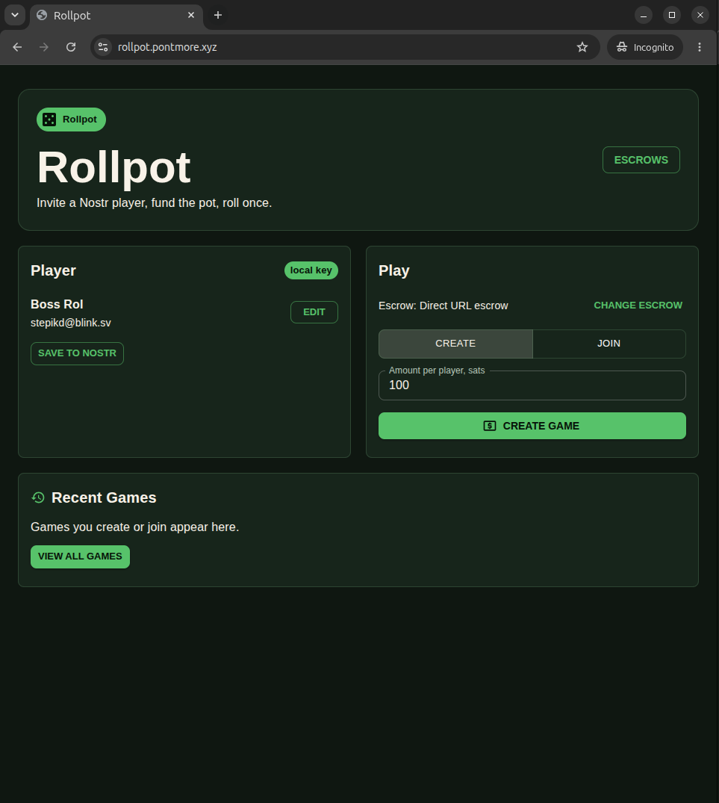

# Rollpot

Invite a Nostr player, fund the pot, and each roll a die. Rollpot is a two-player Lightning dice game built on Pontmore escrows.

**[Play Rollpot live](https://rollpot.pontmore.xyz)**



> **Design:** See [game coordination design](docs/game.md) and [escrow integration](docs/escrow.md). New games use the `rollpot/game@1` PIP-02 chain for their shared lifecycle while Pontmore HTTP escrows remain the source of funding and payout truth.

## Game Play

1. Choose the escrow that will hold the pot.
2. Add your name and the address where you want to receive winnings. You can save your profile publicly if you like.
3. Choose higher roll, lower roll, or a target number from 1 to 6. Create a game and share its invite with a friend, or join a friend's game with their invite. Rollpot shares the game when both players are known.
4. Each player pays the same stake using the payment request shown in the game.
5. Rollpot records your confirmation after your payment arrives.
6. Player 1 rolls one die, then Player 2 rolls one die. The chosen rule decides the winner. If neither wins, both roll again.
7. Once both rolls are shared, Rollpot sends the pot to the winner.

Your recent games appear on the home page, and you can find all your saved games on the Games page. Choosing another escrow applies to your next game; a game you've already started stays with the escrow holding its pot.
After the rolls, choose **Play again** to start a fresh game with the same friend, stake, escrow, and rule. Your friend can join from the invitation on their home page. If it cannot be delivered, the new game shows a code you can copy.

## Development

The client discovers signed PIP-01 escrow descriptors (Nostr kind `30361`) from public relays,
validates each advertised HTTP endpoint and OpenAPI schema, signs NIP-98 HTTP auth events locally,
and polls the escrow service for funding status. New games select a signed descriptor so its exact revision can be pinned in PIP-02.

Only standalone descriptors compatible with Rollpot are selectable: HTTPS transport,
`pontmore_escrow_http_v1`, NIP-98 authentication, the canonical operation set, `2_of_2`
funding, and `application_signed_result` releases.

Rollpot publishes a PIP-02 root after Player 2 joins. Each player signs `core/accept` after their escrow reports payment and signs their own die roll. Player 2's roll references Player 1's roll. Player 1 publishes the result derived from both rolls and authorizes settlement. The Rollpot server observes the escrow and signs `core/secure`, `core/settle`, and `core/refund` as the profile's bound adapter. It records settlement or refund only after the HTTP service reports the corresponding payout completed.

The current escrow verifies application signatures but does not yet bind releases to the Rollpot adapter key. The PIP-02 history is auditable, while money-moving enforcement still depends on the escrow integration described in [docs/escrow.md](docs/escrow.md).
For a rematch, Rollpot sends the new escrow enrollment token to the known partner in a NIP-44 encrypted, signed Nostr invite. Local keys support this directly; extension signers need optional NIP-44 support. The invite is separate from the public game journal, and its sender and recipient pubkeys remain visible in event metadata.

### Run locally

```bash
npm install
npm run dev
```

Open `http://localhost:3002`.

Set `ROLLPOT_SERVER_NSEC` to a stable server-held nsec or 64-character hex secret before creating funded games. Its public key is bound in each PIP-02 root; the server signs economic observations and the escrow application result. Players provide short-lived NIP-98 authorization for service calls. Keep this key out of the browser and version control.

Set `ROLLPOT_DEFAULT_ESCROW_COORDINATE` to the signed PIP-01 address used for the default selection. Rollpot resolves the current kind `30361` event from the configured discovery relays instead of relying on a hardcoded descriptor URL:

```bash
ROLLPOT_DEFAULT_ESCROW_COORDINATE=30361:<publisher-pubkey>:<descriptor-d-tag>
```

### Relay configuration

Set `ESCROW_DISCOVERY_RELAYS` to a comma-separated relay list to override the defaults:

```bash
ESCROW_DISCOVERY_RELAYS=wss://relay.example.com,wss://relay2.example.com npm run dev
```

Set `NOSTR_PROFILE_RELAYS` to override the public relays used to read and publish Nostr player profiles.

Set `NOSTR_GAME_RELAYS` to override the public relays used for shared game records.

### Docker

```bash
docker build -t pontmore/rollpot .
docker run --rm -p 3002:3002 pontmore/rollpot
```
